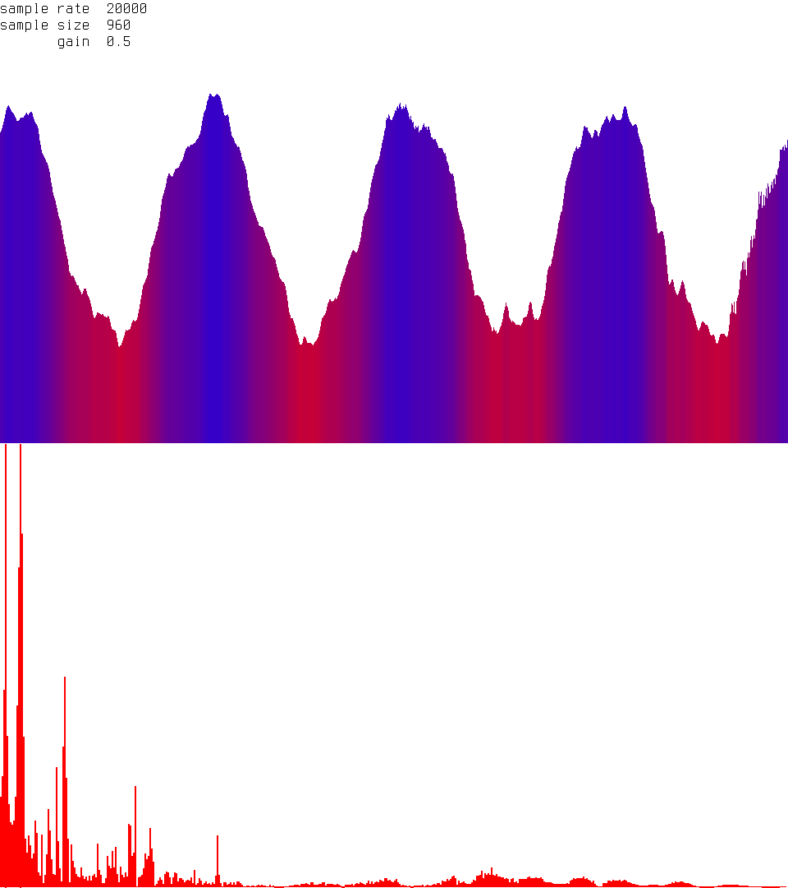

# W A V E S
Visualize audio in the frequency and time domain



### Features
* time and frequency domains are displayed
* signal is smoothed over time
* adjustable sampling rate, sample size, and gain
* adjustable colors and gradients

### Controls
* h - halve sample size
* l - double sample size
* j - decrease sample rate
* l - increase sample rate
* t - increase gain
* g - decrease gain

### Getting Started
You will need python3 installed.

Download the project and create a virtual environment:
```
$ git clone https://github.com/zzggbb/waves
$ cd waves
$ python3 -m virtualenv .
```

Enter the virtual environment and install required packages:
```
$ source bin/activate
$ pip install -r requirements.txt
```

Run the visualizer:
```
$ python3 waves.py
```

Leave the virtual env:
```
$ deactivate
```
