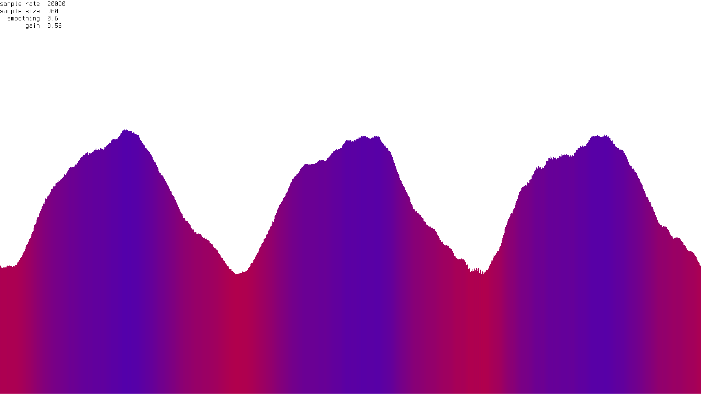

# W A V E S
An FFT based Audio Visualizer



### Getting Started

```
$ git clone https://github.com/zzggbb/waves
$ cd waves
$ python3 -m virtualenv .
$ source bin/activate
$ pip install -r requirements.txt
```

To run the visualizer:
```
$ python3 waves.py
```

To leave the virtual env:
```
$ deactivate
```

### Features
* adjustable sampling rate, sample size, gain, and smoothing
* adjustable colors and gradients
* view audio in the time or frequency domain
