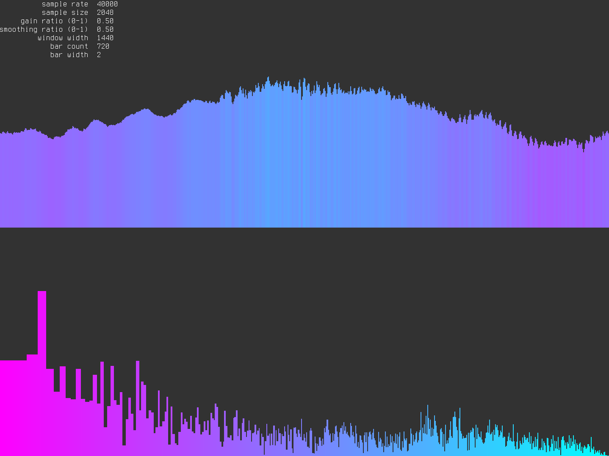

# W A V E S
Visualize audio in the frequency and time domain



### Features
* simultaneous display of time, frequency, and time-frequency domains
* waveform smoothing to reduce flickering
* on the fly adjustments of all parameters:
  * sample rate
  * sample size
  * pull ratio
  * smoothing ratio
  * width and height of output window
  * number of bars displayed
  * start and stop colors of gradient

### Key Bindings
* b - decrease number of displayed bars
* B - increase number of displayed bars
* n - halve sample size
* N - double sample size
* r - decrease sample rate
* R - increase sample rate
* w - decrease output window width
* W - increase output window width
* h - decrease output window height
* H - increase output window height

### Getting Started
You will need python3 installed.

Download the project and create a virtual environment:
```
$ git clone https://github.com/zzggbb/waves
$ cd waves
$ python3 -m virtualenv .
```

Enter the virtual environment and install required packages:
```
$ source bin/activate
$ pip install -r requirements.txt
```

Run the visualizer:
```
$ python3 main.py
```

Leave the virtual env:
```
$ deactivate
```
